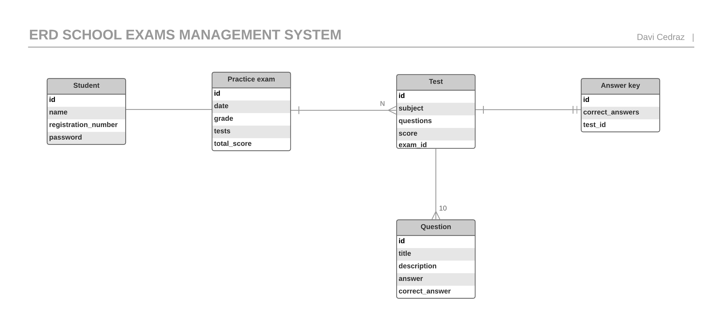
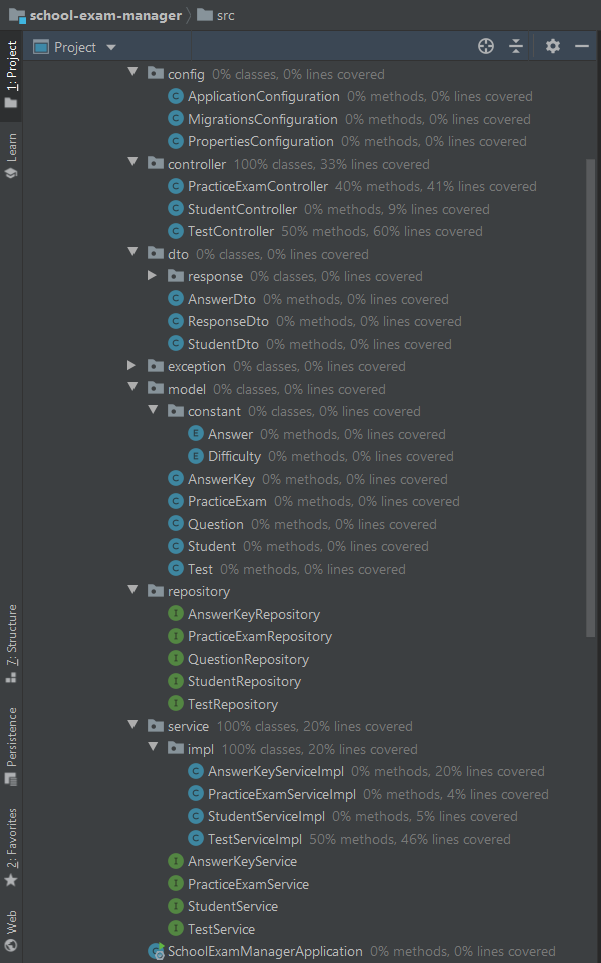
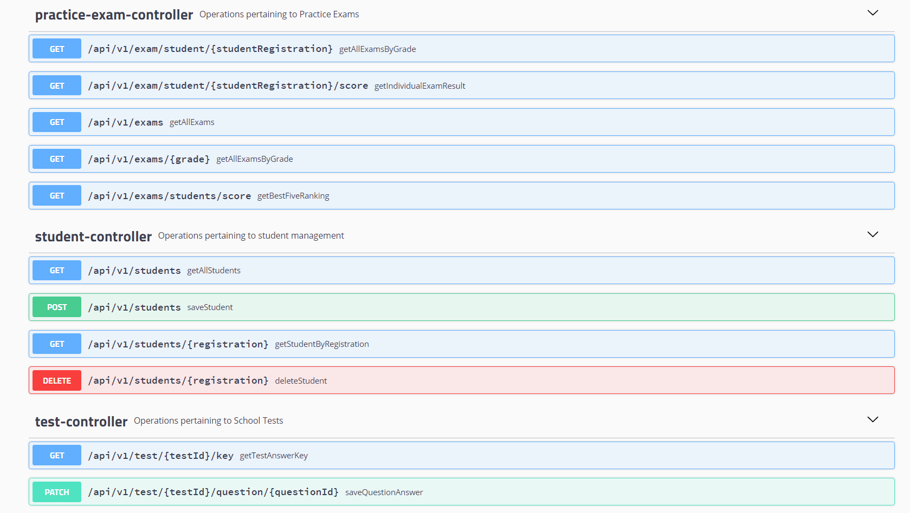
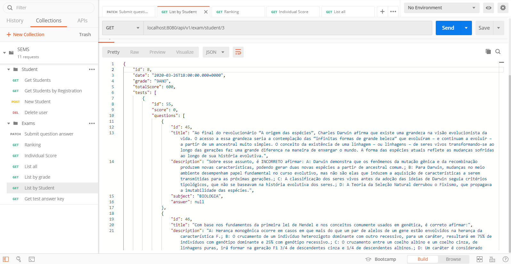

<p align="">
    <a alt="Java">
        
    </a>
    <a alt="Spring Boot">
        
    </a>     
    <a alt="Docker">
        
    </a>
    <a alt="Dependencies">
        
    </a>
    <a alt="License">
        
    </a>
</p>

# School Exams Management System (SEMS)

##### REST API to managing school tests and automatically measure student performance.

### About

This project it is being developed to demonstrate the best way I can, at this point, the use of Spring Boot Framework following all the best practices that are recommended by Spring Framework 5.0. Ensuring the code is loosely coupled and that all the layers in the application are independent of each other and talk using neutral objects. 

This system has just one actor: Student. As a user, he could access any application that consumes this API on browser or App, and, up untill now, can perform the following actions:

- [ ] Login and Signup (Spring security sessions)
- [x] CRUD (Create, Read, Update and Delete) of a Student
- [x] List the Practice Exams with the questions that he need to answer (by grade and Student registration number)
- [x] Answer a question
- [x] List a Answer Key for a Test
- [x] Get a individual score result in a Practice Exam
- [x] List the ranking of the 5 best Students in a Practice Exam

Most of the data was entered through migrations, so that it was possible to quickly validate that the functionalities were implemented correctly and for the integration tests to be performed. In the future, of course that migrations and tests will be rewritten.

### Architecture

In software engineering, the solution architecture is a product of the quality attributes extracted from the requirements and business rules.

The current database schema looks as follows:



- A simulation may have \<N\> tests
- Each test has a list of 10 questions, 3 easy, 4 medium and 3 difficult
- Each test contains a different answer key associated

These following libraries were used during the development:

- [Spring](https://spring.io/) - Server side framework
- [H2](https://www.h2database.com/) - In memory database
- [Swagger](https://swagger.io/) - API documentation
- [Flyway](https://flywaydb.org/) - Database version control (migrations)

### Project Structure

The project structure was designed to maintain the standards indicated by the framework documentation, but also to be in accordance with the structure most used in open source projects Java Spring Boot. The main criterion was to avoid mixing, unnecessarily coupling entities and maintaining code designs (SOLID, DRY, KISS) as far as possible. In the image below, we can also see the current (small) code coverage.



#### Models & DTOs

The various models of the application are organized under the model package, their DTOs (data transfer objects) are present under the dto package. DTOs let us transfer only the data that we need to share with the user interface and not the entire model object that we may have aggregated using several sub-objects and persisted in the database. 

#### Controllers

The controller layer is present in the controller package, the best practices suggest that we keep this layer versioned to support multiple versions of the application and the same practice is applied here. For now code is only present under api/v1.

#### Exceptions

In the hope of shielding the application against exceptions easily, I used a mini-framework created by [Arpit Khandelwal](https://medium.com/@arpit.khandelwal.1984). Using this it was possible to empower the entire services layer to throw entity exceptions in a uniform manner without cluttering the code base with all sorts of NOT_FOUND and DUPLICATE entity exceptions. For example:

```Java
throw exception(EntityType.STUDENT, ExceptionType.ENTITY_NOT_FOUND);
```

This results in clubbing the names of these two enums STUDENT(student) and ENTITY_NOT_FOUND(not.found) and coming up with a key student.not.found which is present in the custom.properties file.

### API Documentation

The tool for API documentation used in this starter kit is Swagger2, and can be open the same inside a browser at the following url - 
http://localhost:8080/swagger-ui.html



You can also import the docs/json/postman_collection.json file on [Postman Platform](https://www.postman.com/) and test all the endpoints with the default data loaded on migrations.



### Build & Run

```bash
$ maven package #or $mvn install
```

Run the Spring Boot app from a command line in a Terminal with the java -jar command:

```bash
$ java -jar target/school-exam-manager-0.0.1-SNAPSHOT.jar
```

We can also Maven plugin to run the app:

```bash
$ mvn spring-boot:run
```

#### Docker

Command to build a [Docker](https://www.docker.com/) container image:

```bash
$ docker build -t school-exam-manager .
```

Command to run the container:

```bash
$ docker run -p 8080:8080 school-exam-manager
```
---

<p align="right">
<a href="https://www.linkedin.com/in/davicedraz/">Davi Cedraz</>
<p>
